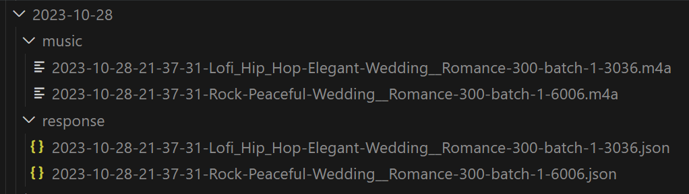

# AI Music Generation via soundraw
Generate music based on metadata using Soundraw's API and this Bash script. 
It processes a CSV file containing music metadata, sends API requests to Soundraw, and downloads the generated music files in .m4a format.

Special thanks for soundraw.io team for making such a great and easy to use API.

For more information, refer to the Soundraw API documentation:

- [POWERFUL AI MUSIC TOOL FOR DEVELOPERS](https://discover.soundraw.io/api)
- [API doc](https://docs.google.com/document/d/185WjC7T1Rq1-9zKlARobmeFiR3VaJcN1IT4ZwDP03Tg/edit#heading=h.3pt5vjbx3xdc)

## Prerequisites
- Bash shell
- jq (JSON processor)
- curl (HTTP client)
- AWK (text processing tool)
- shuf (random number generator)

Ensure these tools are installed and configured on your system.

**Installation of jq on Windows:**
```sh
curl -L -o /usr/bin/jq.exe https://github.com/stedolan/jq/releases/latest/download/jq-win64.exe
```


## Configuration

### .secret File
Create a .secret file in your project directory with the following content. Ensure this file is secure and not accessible publicly.
```
export URL=https://soundraw.io/api/v2/musics/compose
export AUTH_TOKEN='your_soundraw_auth_token'
```

Replace 'your_soundraw_auth_token' with your actual Soundraw auth token.

### generate.sh File

Optionally, you can Configure the default values of the following parameters within the generate.sh file:

- param_file_name: Name of the CSV file containing input parameters (default: soundraw_params.csv)
- num_batches: Number of songs generated per line in the input file (default: 2)
- length: Duration of the generated music in seconds (default: 300)


### Example of soundraw_params.csv

```csv
mood,genres,themes,tempo,tempo_2,energy_levels
Peaceful,Rock,Wedding & Romance,low,,Medium
Elegant,Lofi Hip Hop,Wedding & Romance,normal,normal,Medium
```

## Usage

### Running the Script with Custom Parameters

bash
```
chmod +x generate.sh
./generate.sh custom_soundraw_params 5 30
```

### Running the Script with Default Values

```bash
chmod +x generate.sh
./generate.sh

```

## Sample Music output 

### Listen to the Music file

<audio controls>
    <source src="https://soundraw-api-storage.com/final_c575a1b1-3e1b-4f8e-bbad-65e30b71fd97.m4a" type="audio/m4a">
    Your browser does not support the audio element. 
</audio>

### Download the Music file

[Download the music file](https://soundraw-api-storage.com/final_c575a1b1-3e1b-4f8e-bbad-65e30b71fd97.m4a)

## Script Flow
- Extract music metadata from CSV file.
- Generate a unique output file name.
- Prepare JSON payload for the API request.
- Send POST request to Soundraw's API.
- Download music file if m4a_url is present in the response.
- Save API response and request parameters to a JSON file.
- Exit script if m4a_url is not present, handling errors appropriately.

## Cleanup
Check the output directories (output/$today/music, output/$today/response, output/$today/temp) for downloaded music files, API responses, and temporary files. Manage sensitive data securely.

## Notes
- Ensure the input CSV file and .secret file are correctly formatted and located.
- The API is expected to return a JSON response containing the m4a_url field.

## Screeshots 

### Sample Run Output


### Sample Output Folder



---

## Soundraw API Reference

As of October 5th, 2023, the available values for moods, themes, genres, and energy levels are:

### Moods (24)
    Angry, Busy & Frantic, Dark, Dreamy, Elegant, Happy, Hopeful, Humorous, Light, Love, Mysterious, Neutral, Peaceful, Playful, Powerful, Sad, Scary, Serious, Sexy, Sporty, Suspenseful, Unearthly, Upbeat, Warm

### Genres (22)
    Acoustic, Ambient, Blues, Cinematic, Classical, Country, Dance, Electronic, Folk, Funk, Hip Hop, Jazz, Latin, Metal, Pop, R&B, Reggae, Rock, Soul, World

#### Themes (23)
    1960s, 1970s, 1980s, 1990s, 2000s, Action, Adventure, Animation & Games, Business & Corporate, Celebration & Party, Children, Christmas, Cinematic, Commercials & Advertising, Cooking, Documentary, Drama, Fashion, Halloween, Healing & Meditation, Horror, Love & Romance, Meditation, News, Religious & Gospel, Sci-Fi & Fantasy, Sports, Storytelling, Summer, Suspense & Thriller, Technology, Travel & Nature, Vlog, Wedding & Romance, Winter, Workout, Yoga & Fitness

###  energy_levels
    Very Low, Low, Medium, High, Very High

---

# License

This project is under the MIT License.

---

# Contributing
Suggestions and contributions are always welcome! Follow these steps:

1. Fork the Project
2. Create your Feature Branch (git checkout -b feature/AmazingFeature)
3. Commit your Changes (git commit -m 'Add some AmazingFeature')
4. Push to the Branch (git push origin feature/AmazingFeature)
5. Open a Pull Request

---

# Donations
🌟 **Support & Appreciation** 🌟

If you've found this repository valuable or it has made your work easier, consider expressing your gratitude and encouragement by making a donation. Your support fuels ongoing development and keeps the project thriving. 🚀

[💖 Support the Developer - Donate Now](https://paypal.me/thebilgrami?country.x=US&locale.x=en_US)

Every contribution, no matter how big or small, makes a difference and is immensely appreciated. Thank you for being awesome! 🙌

---
# Acknowledgments

Thank you to all contributors and users of this project!

- Syed Ali Bilgrami (Developer)
- Samina Mukhtar (Tester/Music Enthusiast)

---

# Contact the developer
For inquiries, suggestions, or bug reports, contact us at:

- bilgrami @ gmail . com. Please mention "soundraw.io repo ideas" in the subject line to get priority reply. 

- If this project has been helpful, consider supporting its development by [using this link to donate](https://paypal.me/thebilgrami?country.x=US&locale.x=en_US)

---

# Future plans

- add support for tempo, energy levels, bpm

- add support for creating tracks longer than 300s.

---

# Stay Tuned with saMas Music

🎶 **Stay Tuned with saMas Music!** 🎶

If you're intrigued by the music generated via Soundraw and wish to explore more, make sure to check out our [YouTube channel](https://www.youtube.com/@samasmusic)! 🎥

[🔔 Subscribe Now](https://www.youtube.com/@samasmusic?sub_confirmation=1) and hit the like button to stay updated with our latest musical creations. Your support helps us keep the rhythm alive and continue creating amazing content for you! 💃🕺

Don't forget to share with your friends and spread the love for music! 🎤🎵

Thank you for being a part of our musical journey! 💕
